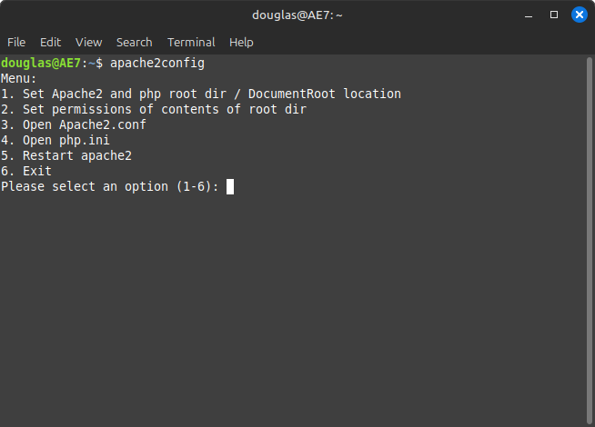
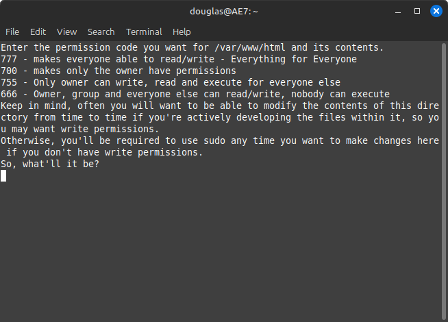

# apache2config
 This app is intended to serve as an easy-to-remember commandline on linux systems to quickly modify apache2 and php configuration settings, and/or bring up the editors for them, to make them slightly more user friendly to newer linux users..

# Install 

You can download the included [.Deb file](apache2config_1.0-1.deb) and install it if your distro supports .deb files.

If your distro does not support deb files, this is just a python script, you can go through whatever steps necessary to register it on your system and it shouldn't be very difficult.